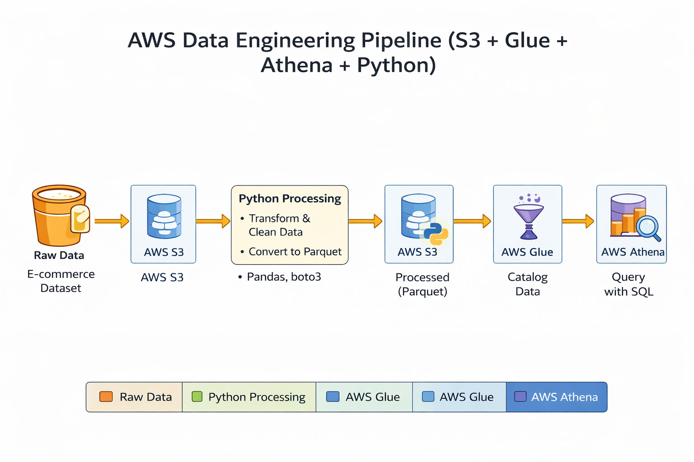
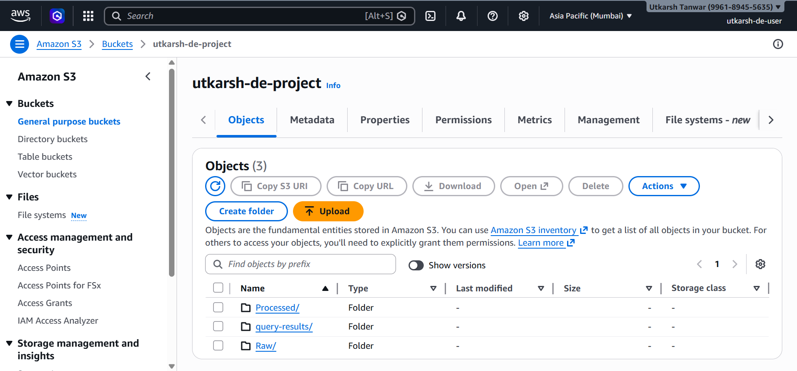
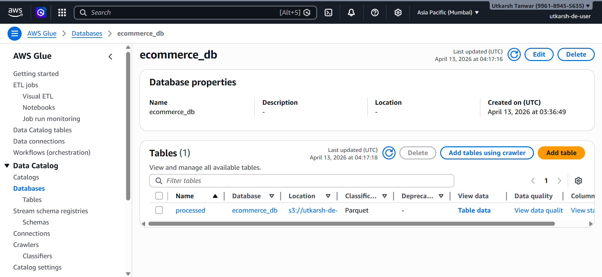
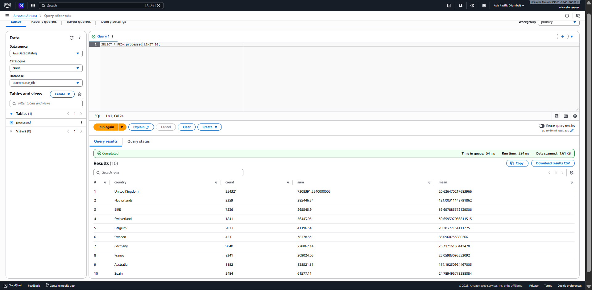
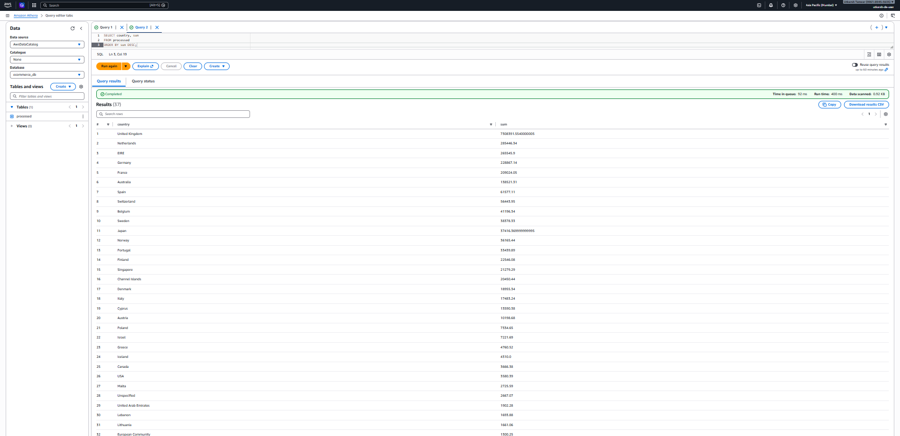

# AWS Data Engineering Pipeline (S3 + Glue + Athena + Python)

Used Kaggle ecommerce retail dataset and built an end-to-end AWS data pipeline.

Ingestion - S3
Transformation - Python
Storage - S3 (Processed - Parquet)
Schema Detection - AWS Glue
Querying - Athena

---

## Architecture / Flow

Raw Data → S3 → Python Processing → S3 (Processed) → Glue → Athena

* Raw Data: Ecommerce retail dataset
* S3: Uploaded raw dataset to S3 object storage
* Python:

  * Explored data using df.head()
  * Converted data types for aggregation
  * Created new column `revenue`
  * Built summary dataset for analysis
* Glue:

  * Created database `ecommerce_db`
  * Used crawler with IAM role for schema detection
* Athena:

  * Queried processed data using SQL

---

## Architecture Diagram



## Tech Stack

* AWS S3
* AWS Glue
* AWS Athena
* Python (pandas, boto3)

---

## Dataset

Source:
https://www.kaggle.com/datasets/ulrikthygepedersen/online-retail-dataset

~5 lakh+ rows ecommerce dataset

---

## Key Steps

### Step 1: Data Ingestion

Uploaded raw dataset to S3

### Step 2: Data Processing

* Cleaned data (removed invalid values)
* Created `revenue` column

### Step 3: Storage

Stored processed data in Parquet format in S3

### Step 4: Data Catalog

Used AWS Glue crawler to create table

### Step 5: Query & Analysis

* Queried data using Athena
* Performed aggregations (country-wise revenue)

---

## Sample Queries

```sql
SELECT * FROM processed LIMIT 10;

SELECT country, sum
FROM processed
ORDER BY sum DESC;

SELECT SUM(count) AS total_orders
FROM processed;
```

---

## Screenshots

### S3 Storage



### Glue Table



### Athena Query



### Analysis



---

## Learnings

* Built an end-to-end AWS data pipeline
* Understood Glue + Athena integration
* Learned how Glue crawler detects schema and IAM role usage
* Learned Parquet format optimization (columnar storage, faster queries)
* Hands-on experience with boto3 in Python

---

## Future Improvements

* Automate pipeline using Airflow / Lambda
* Add dashboard using AWS QuickSight
